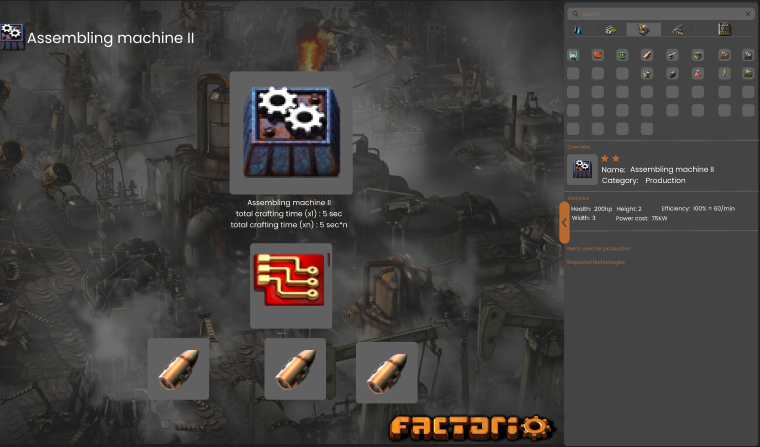
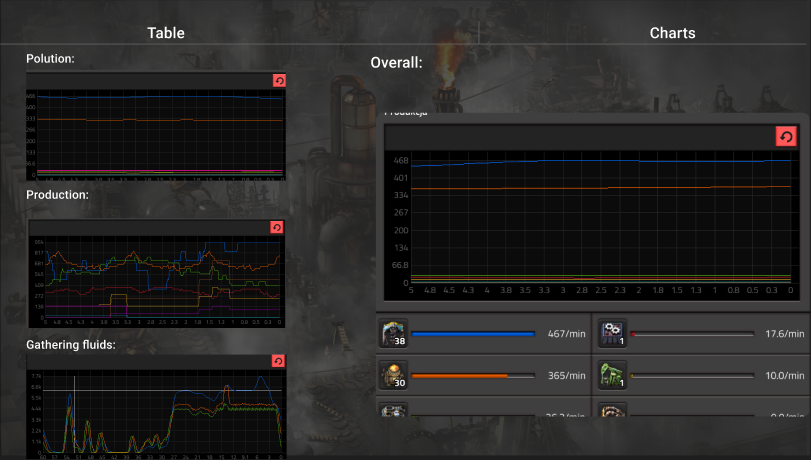

<p align=center>
  
  <b>Angular version: 16.0.0</b>
  &nbsp;  &nbsp;  &nbsp;
  
  <b>RxJs version: 7.8.0</b>
    &nbsp;  &nbsp;  &nbsp;
  
  <b>NgRx version: 16.0.1</b>
    &nbsp;  &nbsp;  &nbsp;
  
  <b>Npm version: 19.x.x</b>
</p>
Factorio Calculator is an application that provides a range of simple and advanced tools and features to enhance the management of your factory.

## Table of contents

- [Getting started](#getting-started)
- [Features](#features)
- [Technical aspects](#technical-aspects)

## Getting started

### System requirements:

- [Node.js](https://nodejs.org/)
- [npm](https://www.npmjs.com/)
- [Angular CLI](https://cli.angular.io/)
- [.NET 7 Runtime (eg. Visual Studio)](https://visualstudio.microsoft.com/pl/thank-you-downloading-visual-studio/?sku=Community&channel=Release&version=VS2022&source=VSLandingPage&cid=2030&passive=false)

### ⚙️Instalation⚙️

1. Clone front-end repository using command 
```bash
git clone https://github.com/KubaKrychowski/Factiorio-caclculator.git
```

2. Install API from [this repository](https://github.com/KubaKrychowski/Factorio-Calculator-API)
3. You can use database backup from this [link](), but feel free setting all items and statistics on your own under this route ```localhost:4200/admin```

##  ✅Features✅
- [Collection of all recipes](#all-recipes-collection)
- [Complex metrics and statistics](complex-metrics-and-statistics)
- [Buildings planer helper](#buildings-planer-helper)
- [Latest patch notes](#patch-notes)

### 🚧All recipes collection🚧
Provided database contains each recipe for every craftable item in game. You can chose how many items u need, what kind of them and system
will calculate for you all needed ingrediends.


### 📈Complex metrics and statistics📈
After creating the factory scheme in **planer** you will be able to start timer which simulates factory working.
Under ```localhost:4200/analytics``` there will be charts and tables with data about:
- power consumption
- polution
- production
It will help you to understand and better manage your production and buildings to save more power and space.


### 📐Buildings planer helper📏
Before you start reading and analysing data system must get informations about your factory. In right menu you can define your factories
and add them to the planer, then you're able simulate your idea💡


## Technical aspects

### Architecture

The application is built with ``` Angular 16 ``` basing on clean code architecture :


Main app folder structure looks like:
- app
  - core
  - modules
  - layout
  - app.module.ts

and each module is based on easy to expand format:
- module
  - components
  - interfaces
      - requests
      - responses
      - store
      - model-1.model.ts
  - services
  - types
  - module.module.ts
  - module-routing.module.ts
 
Services created within modules are intended solely for the purposes of their respective modules. In the event that a service is required in multiple instances, it should be placed in the "shared-module." The same principle applies to "singletons" provided at the root level.

### Design patterns

Some parts of the app implements few design patterns like : ``` builder ``` for objects on factory planer to define calculating configuration, ``` mediator ``` as service responsible for keeping synchronous in time between all buildings, elements on belts, tables and charts.

### Theming

``` Factorio Calculator ``` use ``` Angular Materials 16 ``` with default theme ovverrided for personal purpouses in app layer.

### Assets

- Most of system icons are part of original [Factorio](https://www.factorio.com/) game assets
- Icons on landing page ```localhost/home/lp-1```, logos, etc. were created by: <b> WIktor Kobryń - </b> discord: ```the_murasame```

### Unit testing 

At this moment its too early for unit/e2e tests caused dynamically changing bussiness requirements.
